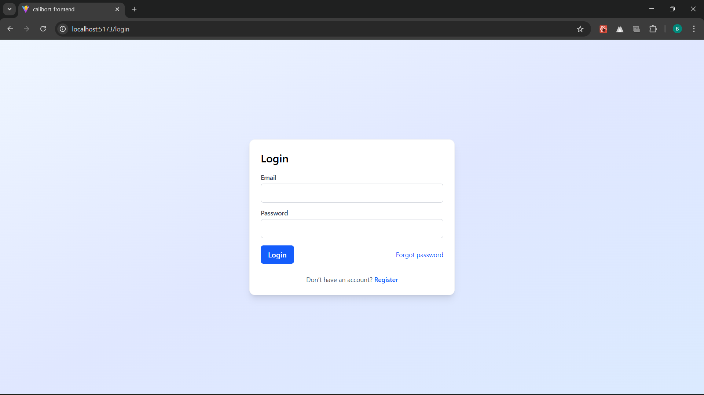
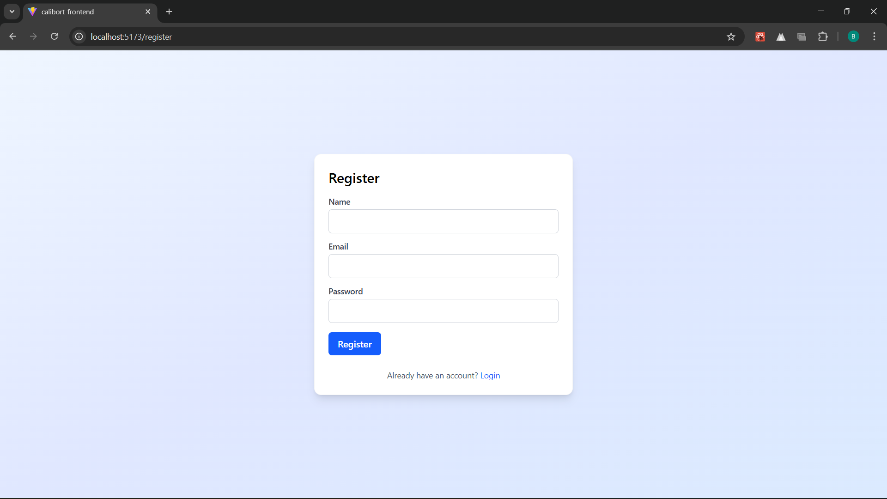
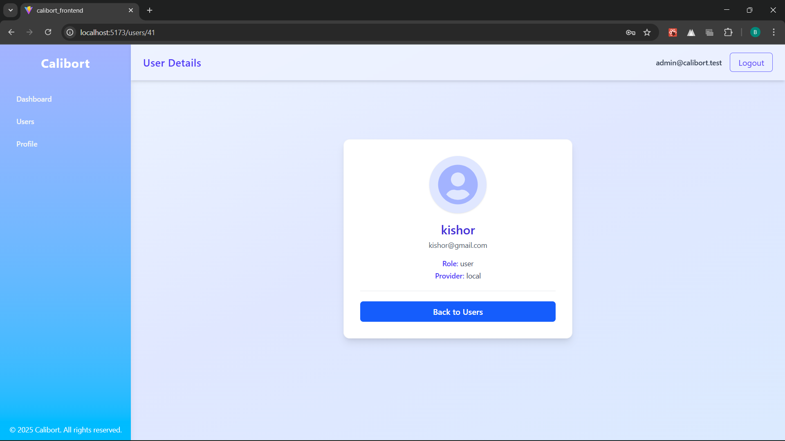

# ✨ Calibort — Backend✨

REST API for Calibort — user management backend written in Node.js + TypeScript using raw SQL (MySQL) via mysql2/promise. Implements auth (access/refresh JWT), user CRUD, role-based access, avatar upload (Cloudinary), password reset, ReqRes import, migrations & seed scripts.

---


## 🔥 Features

- Local authentication (bcrypt + JWT access/refresh)
- Password reset (SMTP)
- Roles: admin / user
- Paginated users list + search
- Import users from ReqRes (bulk upsert)
- Avatar upload (Cloudinary)
- DB migrations and seed (admin user)
- Server-side validation and error handling

---

## ⚙️ Project Setup

### 🧠 Requirements
Make sure you have:
- Node.js 18+ (or similar stable LTS)
- npm or yarn
- MySQL server (local) or managed MySQL (Render, PlanetScale, RDS)
- Cloudinary account & SMTP credentials for email

---

## 🔧 Environment Variables

Create a `.env` file :

```env
# Database
DATABASE_HOST=localhost
DATABASE_PORT=3306
DATABASE_NAME=calibort
DATABASE_USER=root
DATABASE_PASSWORD=Saurabh@123

# Server
PORT=4000
NODE_ENV=development

# Auth
JWT_SECRET=replace_this_in_production
ACCESS_TOKEN_EXPIRES_SEC=900
REFRESH_TOKEN_EXPIRES_DAYS=30

# Email (Gmail example)
SMTP_HOST=smtp.gmail.com
SMTP_PORT=465
SMTP_USER=you@example.com
SMTP_PASS=<app-password>
EMAIL_FROM="Calibort <you@example.com>"
RESET_TOKEN_EXPIRES_MIN=60

# Frontend
FRONTEND_URL=https://calibort-frontend.vercel.app

# Cloudinary (if used)
CLOUDINARY_CLOUD_NAME=...
CLOUDINARY_API_KEY=...
CLOUDINARY_API_SECRET=...

```
##  1.Install & run (local)
```
git clone https://github.com/saurabhraut1212/calibort_backend.git
cd calibort_backend

```
##  2.Install
```
npm install
```
## 3.Ensure DB exists
```
CREATE DATABASE calibort;
```

### 4.Run migrations
```
npm run migrate
```
### 5.Seed admin
```
npm run seed
```

### 6.Start dev server
```
npm run dev
```


## 📸 Screenshots

### 🔐 Login Page


### 🔐 Register Page


### 🏠 Dashboard


### 👥 Users List


### 👤 Profile Page


### 👤 User Details Page


